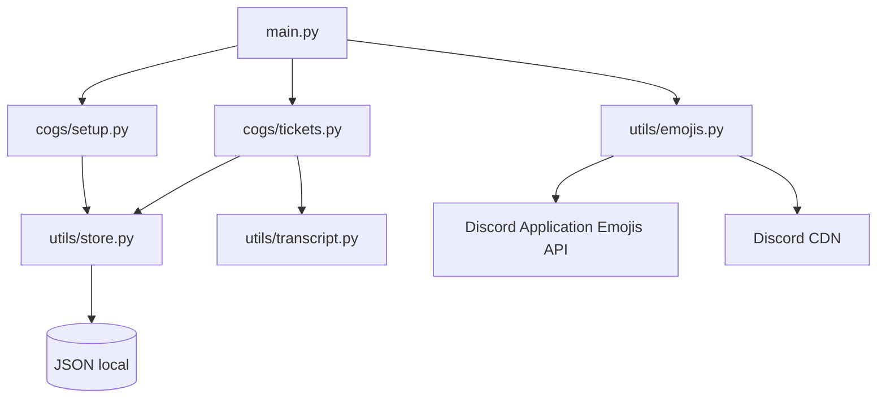

<div align="center">


# 𝑻𝒊𝒄𝒌𝒆𝒕 𝑫𝒊𝒔𝒄𝒐𝒓𝒅 𝑩𝒐𝒕

### Sistema moderno de tickets para Discord, configurável e pronto para hospedar.

[](https://www.python.org/)
[](https://discordpy.readthedocs.io/)
[](./LICENSE)
[](https://github.com/knox-devx)

**Mantido e adaptado por [Knox Dev](https://github.com/knox-devx)**

</div>

---

## ✨ Visão geral

Este projeto é um bot de tickets feito em **Python** com **discord.py** e **Discord Components V2**. Ele possui painéis interativos, formulários configuráveis, transcripts HTML, logs, tickets persistentes e um sistema que sincroniza automaticamente emojis com a própria aplicação do bot.

O nome exibido pelo sistema **não fica preso no código**. Basta definir `BOT_NAME` no `.env`; textos de ajuda e referências ao nome do bot usam esse valor.

> [!IMPORTANT]
> O arquivo `.env` real nunca deve ser enviado ao GitHub. Este repositório inclui somente `.env.example`.

## 🚀 Recursos

- 🎫 Painel de tickets com botões.
- 📋 Painel alternativo em formato dropdown.
- 🧩 Components V2 em mensagens e controles.
- 📝 Formulários de ticket com múltiplas etapas.
- 👤 Sistema de assumir ticket.
- 🔒 Fechar, reabrir e excluir tickets.
- 📄 Transcript HTML do atendimento.
- 🧾 Canal de logs configurável.
- 🛡️ Limite de tickets por usuário.
- 💾 Persistência leve usando JSON.
- 🔁 Views persistentes para botões importantes.
- 🏷️ Nome configurável com `BOT_NAME`.
- 😀 **Sincronização automática de emojis do aplicativo**.
- ♻️ Nova verificação de emojis em segundo plano, sem reiniciar o processo.
- 🇧🇷 Código, comentários e documentação adaptados para português.

---

## 😀 Sincronização automática de emojis

O projeto contém uma lista dos emojis fornecidos para esta versão. Durante a inicialização, o bot:

1. consulta os emojis que já pertencem à própria aplicação;
2. identifica quais estão faltando;
3. obtém a imagem original pelo CDN oficial do Discord;
4. cria o emoji diretamente na aplicação usando a API do Discord;
5. salva os IDs atuais em memória;
6. passa a usar os novos IDs nas mensagens e componentes;
7. repete a verificação automaticamente a cada **5 minutos**.

Se um emoji for removido da aplicação enquanto o bot estiver online, a próxima sincronização tenta criá-lo novamente. Não é necessário reiniciar o bot apenas para atualizar o mapa de IDs.

Os emojis configurados podem ser vistos em [`utils/emojis.py`](./utils/emojis.py).

---

## ⚙️ Configuração

Crie seu `.env` com base em `.env.example`:

```env
TOKEN=SEU_TOKEN_DO_BOT
BOT_NAME=Knox Tickets
```

| Variável | Obrigatória | Função |
|---|:---:|---|
| `TOKEN` | ✅ | Token do bot no Discord Developer Portal |
| `BOT_NAME` | ❌ | Nome exibido pelo bot; padrão: `Knox Tickets` |

### Intents necessários

No **Discord Developer Portal → Bot**, ative:

- **Server Members Intent**
- **Message Content Intent**

> [!NOTE]
> A sincronização de **Application Emojis** é feita com o próprio token do bot pela API oficial do Discord.

---

## 📦 Instalação

```bash
git clone https://github.com/knox-devx/Ticket-Discord-Bot.git
cd Ticket-Discord-Bot
python -m venv .venv
```

### Linux/macOS

```bash
source .venv/bin/activate
pip install -r requirements.txt
python main.py
```

### Windows

```powershell
.venv\Scripts\activate
pip install -r requirements.txt
python main.py
```

---

## 🧭 Comandos principais

| Comando | Função | Permissão |
|---|---|---|
| `/setup` | Abre o assistente de configuração do painel | Administrador |
| `/setup2` | Configura o painel dropdown | Administrador |
| `/panel2` | Envia o painel dropdown já configurado | Administrador |
| `/setform` | Configura formulário em etapas por categoria | Administrador |
| `/close` | Fecha o ticket atual | Ticket/equipe |
| `/add` | Adiciona um membro ao ticket | Ticket/equipe |
| `/remove` | Remove um membro do ticket | Ticket/equipe |
| `/transcript` | Gera o transcript HTML | Ticket/equipe |
| `/ticketinfo` | Exibe informações do ticket | Ticket/equipe |
| `/help` | Exibe a central de ajuda | Todos |

---

## 🗂️ Estrutura do projeto

```text
Ticket-Discord-Bot/
├── .github/
│   └── workflows/
│       └── ci.yml
├── cogs/
│   ├── setup.py
│   └── tickets.py
├── data/
│   └── .gitkeep
├── docs/
│   └── EMOJIS.md
├── utils/
│   ├── config.py
│   ├── emojis.py
│   ├── store.py
│   └── transcript.py
├── .env.example
├── .gitignore
├── LICENSE
├── NOTICE.md
├── README.md
├── main.py
└── requirements.txt
```

---

## 🧠 Arquitetura



---

## 🔐 Segurança

- `.env` está no `.gitignore`.
- O token não deve aparecer em commits, screenshots ou logs públicos.
- Dados reais de `data/configs.json` e `data/tickets.json` não são versionados.
- O transcript escapa conteúdo HTML antes de gerar o arquivo.

---

## 🛠️ Desenvolvimento

Para verificar rapidamente se os arquivos Python estão com sintaxe válida:

```bash
python -m compileall -q main.py cogs utils
```

O repositório também inclui um workflow de **GitHub Actions** que instala as dependências e executa essa validação automaticamente em pushes e pull requests.

---

## 📜 Créditos e licença

<div align="center">

### ✦ Knox Dev ✦

**Manutenção, adaptação, localização e evolução desta versão**

[GitHub](https://github.com/knox-devx)

</div>

O código-base recebido para esta adaptação contém um aviso MIT do autor original. Esse aviso permanece preservado em [`LICENSE`](./LICENSE), como exigido pela licença. Os detalhes da adaptação atual estão em [`NOTICE.md`](./NOTICE.md).

---

<div align="center">


**Feito para Discord • Python • Knox Dev**

</div>
