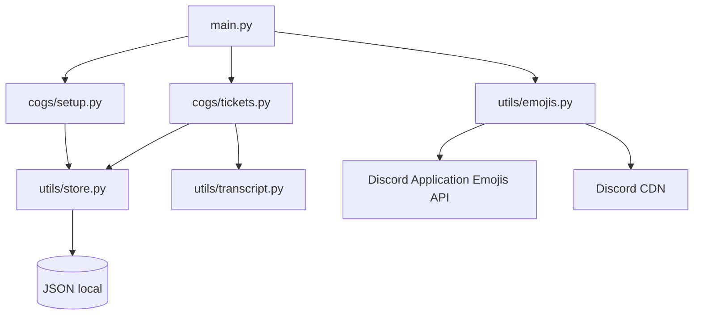

<div align="center">


# 𝑻𝒊𝒄𝒌𝒆𝒕 𝑫𝒊𝒔𝒄𝒐𝒓𝒅 𝑩𝒐𝒕

### Sistema moderno, leve e configurável de tickets para Discord.

[](https://www.python.org/)
[](https://discordpy.readthedocs.io/)
[](./LICENSE)
[](https://github.com/knox-devx)

**Mantido e adaptado por [Knox Dev](https://github.com/knox-devx)**

</div>

---

## ✨ Sobre

Bot de tickets em **Python + discord.py**, com painel persistente, categorias personalizáveis, claim, fechamento, reabertura, exclusão, logs, transcripts HTML, limite por usuário e sincronização automática dos emojis da própria aplicação Discord.

O nome do bot fica centralizado no `.env`:

```env
BOT_NAME=Knox Tickets
```

Sempre que o sistema precisa citar o nome do bot em ajuda, rodapé ou configuração, ele usa esse valor.

> [!IMPORTANT]
> O `.env` real não é enviado ao GitHub. Use `.env.example` como modelo.

## 🚀 Recursos

- 🎫 Painel persistente de abertura de tickets por categoria
- 🛠️ `/setup` com cargo de suporte, canal do painel, categoria, logs, limite e categorias
- 👤 Botão para **assumir** atendimento
- 🔒 Fechar e 🔓 reabrir tickets
- 🗑️ Exclusão com transcript por DM quando possível
- 📄 Transcript HTML com conteúdo escapado por segurança
- 🧾 Logs de abertura, fechamento e exclusão
- 🛡️ Limite de tickets simultâneos por usuário
- ➕ `/add` e `/remove` para controlar acesso ao ticket
- 📝 `/setform` para definir instruções específicas de cada categoria
- 💾 Persistência leve em JSON
- 🏷️ Nome configurável via `BOT_NAME`
- 😀 Sincronização automática de **Application Emojis**
- ♻️ Verificação periódica dos emojis sem precisar reiniciar o processo
- 🇧🇷 Código, comentários e documentação em português

---

## 😀 Emojis automáticos

O arquivo [`utils/emojis.py`](./utils/emojis.py) contém os emojis fornecidos para esta versão. Ao ficar online, o bot:

1. lista os emojis existentes na própria aplicação Discord;
2. compara pelos nomes;
3. baixa pelo CDN oficial a imagem dos emojis que estiverem faltando;
4. cria os emojis na aplicação pela API do Discord usando o token do próprio bot;
5. atualiza os IDs usados em memória;
6. repete a verificação automaticamente a cada **5 minutos**;
7. respeita `429` e o `retry_after` informado pelo Discord.

Se a primeira sincronização falhar por indisponibilidade temporária, o bot continua funcionando com os IDs de origem como fallback e tenta novamente depois.

> [!NOTE]
> Mensagens antigas já enviadas pelo Discord não são reescritas automaticamente. Novos painéis e novos componentes passam a usar o mapa de IDs atualizado.

---

## ⚙️ `.env`

Copie `.env.example` para `.env`:

```env
TOKEN=SEU_TOKEN_DO_BOT
BOT_NAME=Knox Tickets
```

| Variável | Obrigatória | Descrição |
|---|:---:|---|
| `TOKEN` | ✅ | Token do bot no Discord Developer Portal |
| `BOT_NAME` | ❌ | Nome usado pelo sistema; padrão: `Knox Tickets` |

### Intents

No **Discord Developer Portal → Bot**, ative:

- **Server Members Intent**
- **Message Content Intent**

---

## 📦 Instalação

```bash
git clone https://github.com/knox-devx/Ticket-Discord-Bot.git
cd Ticket-Discord-Bot
python -m venv .venv
```

### Linux/macOS

```bash
source .venv/bin/activate
pip install -r requirements.txt
python main.py
```

### Windows

```powershell
.venv\Scripts\activate
pip install -r requirements.txt
python main.py
```

---

## 🧭 Comandos

| Comando | Função | Permissão padrão |
|---|---|---|
| `/setup` | Configura e envia o painel | Administrador |
| `/panel2` | Reenvia o painel salvo | Administrador |
| `/setupinfo` | Mostra a configuração atual | Administrador |
| `/setform` | Define instruções para uma categoria | Administrador |
| `/close` | Fecha o ticket atual | Usuário com acesso |
| `/add` | Adiciona um membro ao ticket | Usuário com acesso |
| `/remove` | Remove um membro do ticket | Usuário com acesso |
| `/transcript` | Gera o transcript HTML | Usuário com acesso |
| `/ticketinfo` | Mostra dados do ticket | Usuário com acesso |
| `/help` | Exibe ajuda | Todos |

---

## 🗂️ Estrutura

```text
Ticket-Discord-Bot/
├── .github/workflows/ci.yml
├── cogs/
│   ├── setup.py
│   └── tickets.py
├── data/.gitkeep
├── docs/EMOJIS.md
├── utils/
│   ├── config.py
│   ├── emojis.py
│   ├── store.py
│   └── transcript.py
├── .env.example
├── .gitignore
├── LICENSE
├── NOTICE.md
├── README.md
├── main.py
└── requirements.txt
```

## 🧠 Arquitetura



---

## 🔐 Segurança

- `.env` ignorado pelo Git
- dados reais de tickets/configurações não são versionados
- token não aparece no código
- transcripts escapam HTML de mensagens, nomes e anexos
- sincronizador trata rate limits do Discord

## ✅ Validação automática

O workflow em `.github/workflows/ci.yml` instala as dependências e executa:

```bash
python -m compileall -q main.py cogs utils
```

em pushes e pull requests.

---

## 📜 Créditos

<div align="center">

### ✦ Knox Dev ✦

**Manutenção, adaptação, localização e evolução desta versão**

</div>

O código-base recebido veio com uma licença MIT e atribuição do autor original. O aviso original foi preservado em [`LICENSE`](./LICENSE), e a atribuição desta versão está detalhada em [`NOTICE.md`](./NOTICE.md).

---

<div align="center">


**Discord • Python • Knox Dev**

</div>
